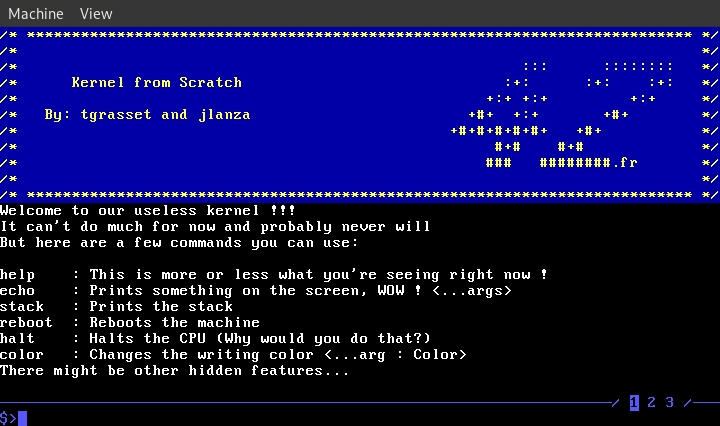

# Kernel From Scratch

This project aims to build a minimalistic operating system kernel from scratch. This is just an introduction to barebone programming in rust, so our kernel doesn't do much for now.

## Features

- Boots with GRUB.
- Prints to the screen using VGA buffer.
- Sets up a Global Descriptor Table.
- Provides a simple terminal interface with a few commands listed below.
- Written in assembly language and Rust.
- Provides a foundation for learning about operating system internals and kernel development.
- Still very early stage kernel, no interrupts, no paging, at least for now...

## Getting Started

1. Clone the repository: `git clone https://github.com/tgrasset/kfs.git`
2. Navigate to the project directory: `cd kfs`
3. Compile and link binary, build the bootable iso file (all done in a docker) and then run the kernel with qemu: `make run`

## Usage

Available commands : 
- `help` : Prints a list of available commands and what they do
- `color` : Changes writing color
- `echo` : Prints on the screen
- `stack` : Prints the content of the stack (must be given a size)
- `42` : Prints '42', that was the first thing our kernel did so we kept it !
- `reboot` : Reboots the machine
- `halt` : Halts the CPU (since our kernel doesn't handle interrupts yet, this basically freezes everything 🙃)
- `clear` : Clears the terminal screen
- `gdt` : Prints the content of the Global Descriptor Table at address 0x800
- `s` : Switch tab
- `1`, `2`, `3`: Goes directly to tab 1, 2 or 3.
- `tetris` : 🎮

Scroll up and down with up and down arrows, move cursor with left and right arrows.

## Acknowledgements

This project was made with my teammate [lanzaj](https://github.com/lanzaj)
 at 42school.
